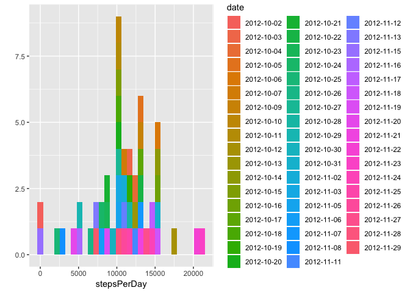
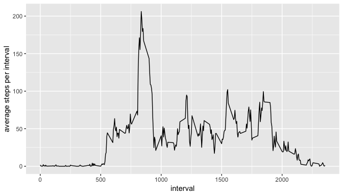
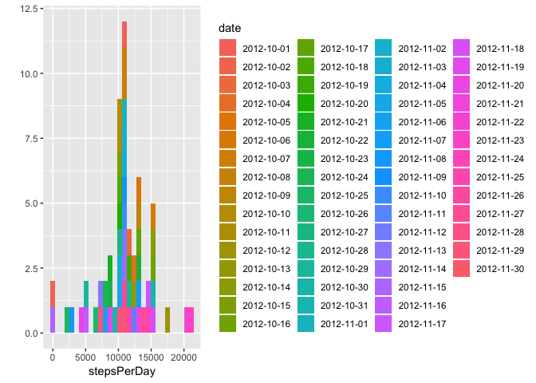
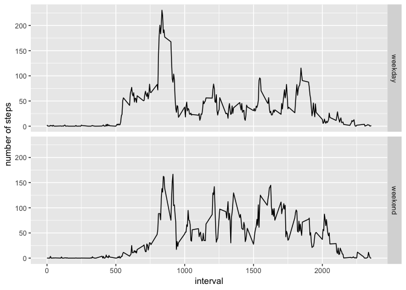

## Loading and preprocessing the data
In this part, we will first load the data. No data processing will be implemented in this part, but later when required.

We load the data into *data*. And 

```r
data <- read.csv("activity.csv")
```


## What is mean total number of steps taken per day?
To begin with, we should calculate the total number of steps taken per day. We use functions in *dplyr* package, so we should include it first. Then we name the new dataframe *steps_per_day* (NAs are delected).

```r
library(dplyr)
```

```
## 
## Attaching package: 'dplyr'
```

```
## The following objects are masked from 'package:stats':
## 
##     filter, lag
```

```
## The following objects are masked from 'package:base':
## 
##     intersect, setdiff, setequal, union
```

```r
steps_per_day <- data %>% group_by(date) %>% 
  summarize(stepsPerDay = sum(steps, na.rm = TRUE)) %>% 
  filter(stepsPerDay != 0)
```
Now we can figure the questions out.

### 1. Make a histogram of the total number of steps taken each day
We use package *ggplot2* to plot this histogram. Not only do we hist it, but we set the color by each day, so that we can find where a exact day belongs to.

```r
library(ggplot2)
qplot(stepsPerDay, data = steps_per_day, geom = "histogram", fill = date, bins = 30)
```

<!-- -->

### 2. Calculate and report the mean and median total number of steps taken per day
Still, with function *summarize* in *dplyr*, we can easily get the report.

```r
library(xtable)
mean_median <- steps_per_day %>% summarize(mean = mean(stepsPerDay), 
                                           median = median(stepsPerDay))
print(xtable(mean_median), type = "html")
```

<!-- html table generated in R 3.5.1 by xtable 1.8-2 package -->
<!-- Mon Aug  6 15:48:43 2018 -->
<table border=1>
<tr> <th>  </th> <th> mean </th> <th> median </th>  </tr>
  <tr> <td align="right"> 1 </td> <td align="right"> 10766.19 </td> <td align="right"> 10765 </td> </tr>
   </table>

## What is the average daily activity pattern?
Just as what we did last part, we first calculate the average steps per interval across all days, and stored in *steps_per_interval*.

```r
steps_per_interval <- data %>% group_by(interval) %>%
  summarize(stepsPerInterval = mean(steps, na.rm = TRUE))
```
With data above, we can get the answer to the two questions.

### 1. Make a time series plot (i.e. type = "l") of the 5-minute interval (x-axis) and the average number of steps taken, averaged across all days (y-axis)
Here again, we use *ggplot2* to derive this time series plot.

```r
qplot(interval, stepsPerInterval, data = steps_per_interval, geom = "line", 
      ylab = "average steps per interval")
```

<!-- -->

### 2. Which 5-minute interval, on average across all the days in the dataset, contains the maximum number of steps?
We use *which* function to get the interval with the maximum number of steps.

```r
max_interval <- steps_per_interval$interval[which(steps_per_interval$stepsPerInterval == 
                                                max(steps_per_interval$stepsPerInterval))]
```
So the 835th 5-minute interval contains the maximum number of steps. 

## Imputing missing values
### 1. Calculate and report the total number of missing values in the dataset (i.e. the total number of rows with NAs)
We can easily solve this by R command:

```r
missing_value <- sum(is.na(data$steps))
```
Then we can know that there are 2304 missing values in the dataset.

### 2. and 3. Devise a strategy for filling in all of the missing values in the dataset. The strategy does not need to be sophisticated. For example, you could use the mean/median for that day, or the mean for that 5-minute interval, etc. Create a new dataset that is equal to the original dataset but with the missing data filled in.
This time, we easily use the mean for each 5-minute interval across all days to fill the NAs. And store the output in *data_filled*.

```r
data_filled <- data
for (i in 1:length(data_filled$interval)) {
  if(is.na(data_filled$steps[i])){
    data_filled$steps[i] <- steps_per_interval[steps_per_interval$interval == 
                                                 data_filled$interval[i], ]$stepsPerInterval
  }
}
```

### 4. Make a histogram of the total number of steps taken each day and Calculate and report the mean and median total number of steps taken per day. Do these values differ from the estimates from the first part of the assignment? What is the impact of imputing missing data on the estimates of the total daily number of steps?
To make a histogram report the mean and median, it is the same as what we did in part 2.

```r
steps_per_day_filled <- data_filled %>% group_by(date) %>% 
  summarize(stepsPerDay = sum(steps, na.rm = TRUE))
qplot(stepsPerDay, data = steps_per_day_filled, geom = "histogram", fill = date, bins = 30)
```

<!-- -->

```r
mean_median_filled <- steps_per_day_filled %>% summarize(mean = mean(stepsPerDay), 
                                           median = median(stepsPerDay))
print(xtable(mean_median_filled), type = "html")
```

<!-- html table generated in R 3.5.1 by xtable 1.8-2 package -->
<!-- Mon Aug  6 15:48:46 2018 -->
<table border=1>
<tr> <th>  </th> <th> mean </th> <th> median </th>  </tr>
  <tr> <td align="right"> 1 </td> <td align="right"> 10766.19 </td> <td align="right"> 10766.19 </td> </tr>
   </table>

And we can compare the mean and midian between data with and without filling NAs.

```r
mean_median_full <- rbind(mean_median, mean_median_filled)
rownames(mean_median_full) <- c("before filled", "filled")
```

```
## Warning: Setting row names on a tibble is deprecated.
```

```r
print(xtable(mean_median_full), type = "html")
```

<!-- html table generated in R 3.5.1 by xtable 1.8-2 package -->
<!-- Mon Aug  6 15:48:47 2018 -->
<table border=1>
<tr> <th>  </th> <th> mean </th> <th> median </th>  </tr>
  <tr> <td align="right"> before filled </td> <td align="right"> 10766.19 </td> <td align="right"> 10765.00 </td> </tr>
  <tr> <td align="right"> filled </td> <td align="right"> 10766.19 </td> <td align="right"> 10766.19 </td> </tr>
   </table>

Therefore, as the table shows, this method to fill NAs doesn't influence the mean but the median.

## Are there differences in activity patterns between weekdays and weekends?
### 1. Create a new factor variable in the dataset with two levels -- "weekday" and "weekend" indicating whether a given date is a weekday or weekend day.
It is easy to get the weekdays of dates. However, a function to distinguish weekday and weekend is still required. Such a function is created first and the factor w/2 variable *weekday* is then created by this function and *mutate* in package *dplyr*

```r
check_weekday <- function(daylist){
  for (i in 1:length(daylist)) {
    if(daylist[i] == "Saturday" | daylist[i] == "Sunday"){daylist[i] <- "weekend"}
    else{daylist[i] <- "weekday"}
  }
  daylist
}
data_filled <- data_filled %>% mutate(weekday = weekdays(as.Date(date))) %>% 
  mutate(weekday = check_weekday(weekday)) %>% 
  mutate(weekday = factor(weekday))
```

### 2. Make a panel plot containing a time series plot (i.e. type = "l") of the 5-minute interval (x-axis) and the average number of steps taken, averaged across all weekday days or weekend days (y-axis). 
We will still use *ggplot2* to plot this figure, so it is different from the template figure in style. Before plotting, we need to group the data and get the average again.

```r
steps_per_interval_weekday <- data_filled %>% group_by(interval, weekday) %>%
  summarize(stepsPerIntervalWeekday = mean(steps, na.rm = TRUE))
qplot(interval, stepsPerIntervalWeekday, data = steps_per_interval_weekday, geom = "line",
      ylab = "number of steps", facets = weekday~.)
```

<!-- -->


